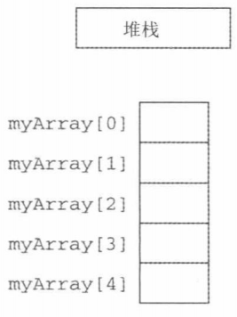
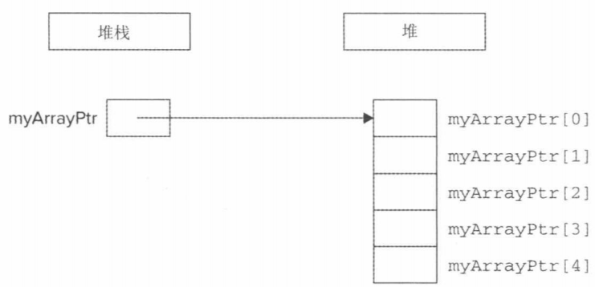

# 数组

数组用于容纳一系列紧靠的无名对象，数组的大小必须是编译期间就已知的常量，并且是不可变的。

## 数组初始化

- 数组可以用列表初始化，如果进行列表初始化时不提供维度，则编译器从初始值列表中推断。

- 如果指定了维度，则初始列表的个数一定不能超过维度，否则将是编译错误。
- 如果初始值列表长度不足维度数，则剩余的元素将执行值初始化，对于内置类型来说就是都初始化为 0 。

```
int a2[] = {0, 1, 2};   //@ array 的维度是 3
int a3[5] = {0, 1, 2};  //@ 等价于 a3[] = {0, 1, 2, 0, 0}
string a4[3] = {"hi", "bye"};   //@ 等价于 a4[] = {"hi", "bye", ""}
int a5[2] = {0,1,2};    //@ 错误，初始化值的个数超过了数组的维度
```

- 不能使用数组赋值另一个数组。

## 复杂的数组声明

- 数组元素不能是引用类型。

```
int *ptrs[10]; //@ ptrs 是一个数组，包含 10 个 int* 元素
int (*Parray)[10]; //@ Parray 是一个指针，指向一个包含 10 个 int 类型的数组
int (&arrRef)[10]; //@ arrRef 是一个引用，绑定到包含有 10 个 int 类型的数组
int &refs[10] = /* ? */;    //@ 错误，数组元素不能是引用类型
```

## 栈上数组与堆上数组

### 栈上数组

```
int myArray[5];
```



### 堆上数组

```
int* myArrayPtr = new int[5];
```




# 多维数组


